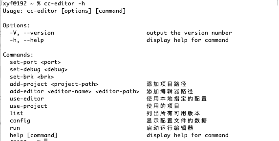

# cc-editor
通过cli启动调试Creator主进程，也可以进行简单的Creator的版本和项目管理工作。

# 使用前的配置

1. 添加项目、编辑器配置信息
> cc-editor add-project 项目路径

> cc-editor add-editor 编辑器别名 编辑器路径

2. 选择项目、编辑器的配置，以下2个命令是交互式的，不需要手动输入
> cc-editor use-project

> cc-editor use-editor

3. 启动运行项目
> cc-editor run

# 使用场景

## 日常开发启动项目
当项目开始正式开发后，每天打开的Creator版本和项目其实是固定的，每次都要启动编辑器比较麻烦，通过cli的一些简单配置，就可以通过命令行一键启动。
 
## 调试插件主进程
当开发Creator插件时，需要调试主进程，每次都需要添加那些记不住而又不得不输入的调试参数，通过这个cli，可以免去这些烦恼。

> cc-editor set-debug true

设置为true后，项目就会开启主进程调试功能

> cc-editor set-port 2021
 
设置主进程调试的端口

> cc-editor set-brk true

设置是否在主进程的第一行代码设置断点

`更多功能，不定期更新...`
